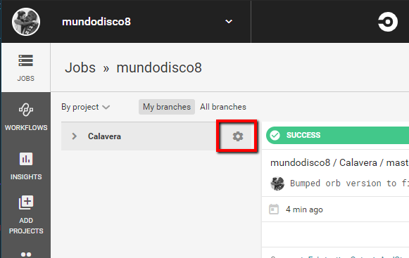
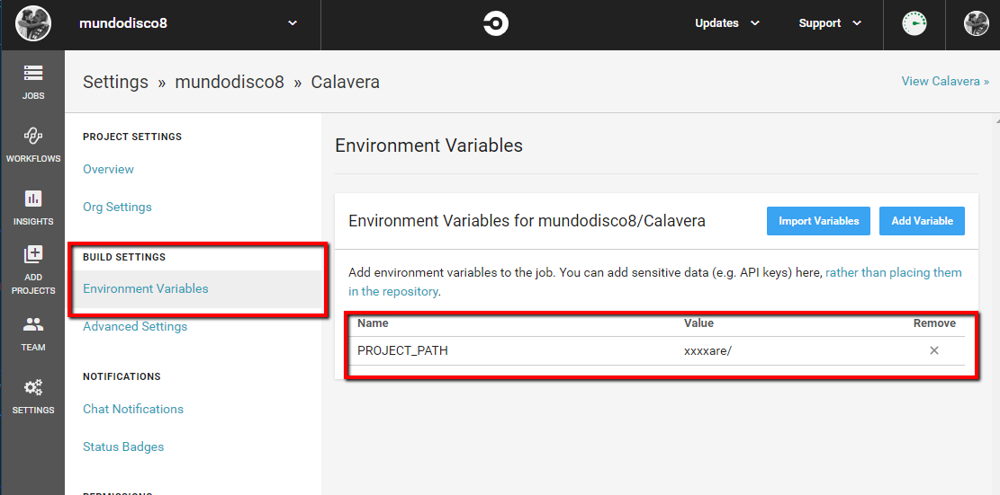
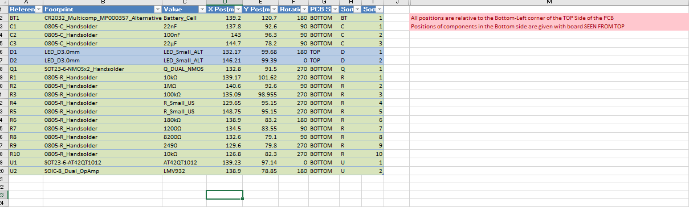

# kicadCD

kicadCD circleCI's orb, an orb to help automating the generation of production files for KiCad projects. It uses [Kiplot](https://github.com/johnbeard/kiplot) to get Gerbers and other PCB "plots" and [KiBoM](https://github.com/SchrodingersGat/KiBoM) to generate the bill of materials., as well as a number of other Python modules.

I'm by no means an expert on this whole CI/CD, docker, python thing, and this project responds to a very particular necessity. It adjusts to my workflow, and that means that might not adjust to yours, but feel free to suggest any improvements.

## v0.1.0 (14/01/2020)

First release of the orb. Not really intended for general use as it's pretty much WIP and will probably will change a lot in the short term. It can generate Gerbers with Kiplot, bill of materials with KiBom the positions file for the pick and place.

## How to Use:

### Initial Setup:

The orb can clone the repo containing your project with the `initialSetup` job. it will be cloned in the default path (`/root/project/`). The artifact storage folder will be created in this step too (`/root/project/artifacts`).

You will also have to add an environmental variable to your project that contains the path to the KiCad project. You can choose any name you want for it, but the default if none is specified is PROJECT_PATH





### Generate Positions file:

To create a part positions' file, use the `pickAndPlacePositions` job. The result is an Excel spreadsheet with the positions of all the parts (unless they are "virtual") referenced to the local origin (not the absolute), their rotation, PCB side and two extra columns with the let
ters and numbers of the part reference, so they can be sorted in natural order (that is, C1, C2, ..., C9, C10, ... instead of the normal C1, C10, C11, C2, C20, C3, ... which drives me nuts).



> Be aware that the excel file has a note indicating that the origin for the XY coordinates is the bottom right corner of the board, when seen from the top. Yours might be different!!

It takes four parameters:

- projectPath: an environmental variable containing the path to the Kicad project. The default value is `PROJECT_PATH` (described in the initalSetup task)
- PCBFile: the name of the pcb file to get the parts from. It must be the name only (or a path relative to projectPath) and contain the extension (`.kicad_pcb`).
- includeVirtualComponentsFlag: a boolean flag to indicate if you want the virtual components listed in your file. It might be useful to get the positions of test pads, fiducials, mounting screws, ... The script used to generate the positions uses it, but it's not wired in CircleCI, so it's being ignored at the moment.
- artifactsPath: the path to store the excel file generated. The file will be named `PCBFile_Positions.xlsx`

### Generate Gerber Files

- artifactsPath: the path to store the tar.gz file with the outputs of the process. By default, they will be stored in `/root/project/artifacts/`.

It creates a tar.gz file with all the files generated. To indicate which layers to plot, use the Kiplot configuration file (a yaml file that must be named 'Kiplot_config.yaml' and must be stored in the path specified by PROJECT_PATH).

## Stuff I use to make this thing work, in no particular order

- [KiBoM](https://github.com/SchrodingersGat/KiBoM)
- [Kiplot](https://github.com/johnbeard/kiplot)
- [openPyXL](https://openpyxl.readthedocs.io/en/stable)

## Detailed Description

### Commands

#### clone_script_repo

In order to be able to run the scripts, you need to clone the Kicad_Python_Scripts repo. I could pack them with my docker image, but then I would need to publish a new version every time I modify one of the scripts.

**Usage**: just call `clone_script_repo`.

#### create_pick_and_place_file

This command creates the pick and place file. It outputs an excel file with the position of all the files, using the **auxiliary axis origin** of the PCB.

**Parameters**:

- projectPath (environmental variable): it's the name of the environmental variable that contains the path to the project. By default, your repo is cloned to `/root/project/`. If you need to specify a particular path for your hardware files, create an environmental variable, and use it's name as the value for the `projectPath`.
- PCBFile (string): name of the KiCad PCB file, including the `.pcbnew` extension.
- includeVirtualComponetsFlag (boolean): indicates if you want all the components in the pick and place file, or just the ones labelled SMD. Useful if you want to add fiducials or mounting holes and the like. `False` by default.
- artifactsPath (string): path to the directory that will hold the artifacts. `/root/project/artifacts/` by default.

**Steps**:

1) Make the scripts callable: the first step moves the python script to /usb/local/bin and makes it executable. That way it can be called without needing to specify the path.
1) Generate positions file: runs the Python script with the specified parameters.
1) Move artifacts: stores the excel file in the artifactsPath folder.

#### create_gerbers

Generates the Gerber files for this project. It uses `configFile` to indicate which layers and in what format you want to output the files. The output is zipped and stored in the artifacts folder.
It uses a forked version of KiPlot to be able to print gerbers for internal layers. I submitted a PR but is not being merged :S.

**Parameters**:

- projectPath (environmental variable): it's the name of the environmental variable that contains the path to the project. By default, your repo is cloned to `/root/project/`. If you need to specify a particular path for your hardware files, create an environmental variable, and use it's name as the value for the `projectPath`.
- PCBFile (string): name of the KiCad PCB file, including the `.pcbnew` extension.
- configFile: a KiPlot config file indicating which layers to plot and in what format. You can find examples [here](https://github.com/johnbeard/kiplot/blob/master/docs/samples/generic_plot.kiplot.yaml) and [here](https://github.com/mundodisco8/Calavera/blob/master/hardware/Kiplot_config.yaml).
- artifactsPath (string): path to the directory that will hold the artifacts. `/root/project/artifacts/` by default.

**Steps**:

1) Calls KiPlot with the specified configuration, zips the output and stores it in the artifacts Path.

#### store_artifacts_cmd

Stores the artifacts in circleCI. CircleCI requires a "store" step in order to make the files in a certain directory accessible.

**Parameters**:

- artifactsPath (string): path to the directory that will hold the artifacts. `/root/project/artifacts/` by default.

**Steps**:

1) Marks the files present in the specified path as artifacts accessible through the WebUI.

### Jobs

#### intialSetup

Performs the first steps needed to start working on the project. It checks the project out, creates the artifacts folder, clones the scripts repository and makes the workspace persistent.

NOTE: it's probably not the best way to do this, but I couldn't find a less awkward way to do it than making the workspace persistent. Otherwise, it gets a new environment for each job... maybe some day I will discover how to do it properly.

#### pickAndPlacePositions

This job generates the pick and place positions file and makes it accessible as an Artifact.
It requires the initialSetup job to be executed first.

**Parameters**:

- projectPath (environmental variable): it's the name of the environmental variable that contains the path to the project. By default, your repo is cloned to `/root/project/`. If you need to specify a particular path for your hardware files, create an environmental variable, and use it's name as the value for the `projectPath`.
- PCBFile (string): name of the KiCad PCB file, including the `.pcbnew` extension.
- includeVirtualComponetsFlag (boolean): indicates if you want all the components in the pick and place file, or just the ones labelled SMD. Useful if you want to add fiducials or mounting holes and the like. `False` by default.
- artifactsPath (string): path to the directory that will hold the artifacts. `/root/project/artifacts/` by default.

#### gerberFiles

This job generates the gerber files for your PCB file and makes them accessible as an Artifact.
It requires the initialSetup job to be executed first.

**Parameters**:

- projectPath (environmental variable): it's the name of the environmental variable that contains the path to the project. By default, your repo is cloned to `/root/project/`. If you need to specify a particular path for your hardware files, create an environmental variable, and use it's name as the value for the `projectPath`.
- PCBFile (string): name of the KiCad PCB file, including the `.pcbnew` extension.
- configFile: a KiPlot config file indicating which layers to plot and in what format. You can find examples [here](https://github.com/johnbeard/kiplot/blob/master/docs/samples/generic_plot.kiplot.yaml) and [here](https://github.com/mundodisco8/Calavera/blob/master/hardware/Kiplot_config.yaml).
- artifactsPath (string): path to the directory that will hold the artifacts. `/root/project/artifacts/` by default.

### Executors

All the tasks are run on a custom Ubuntu image. The image is based in Ubuntu 19.10 and has a minimal KiCad 5 installed. It also pulls a couple of my repos with scripts and a couple of python modules.

### Publishing a new version

#### Validate the orb

``` bash
circleci orb validate kicadcd.yml
```

#### List your orbs

``` bash
circleci orb list {namespace}
```

``` bash
circleci orb list mundodisco8
```

To get info about a particular orb

``` bash
circleci orb info {namespace}/{orb}
```

``` bash
circleci orb info mundodisco8/kicad-manufacturing-files@dev:19_10_24
```

#### Publish the orb

You can publish an orb either as a production orb or a development one. They are always public, but dev ones will disappear in 90 days.

To publish a development orb:

``` bash
circleci orb publish {pathToOrb} {namespace}/{orbName}
```

Use the `increment` command to increment the version number of a published orb, or `promote` to promote a dev Orb to production.
